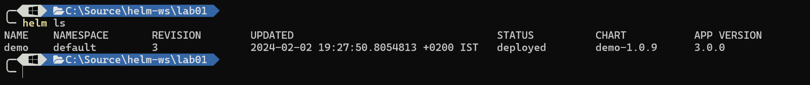
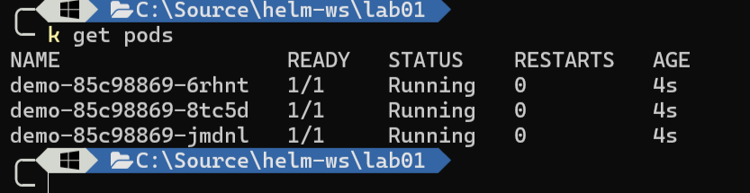

# Lab 01-Creating a Helm Chart

estimated time: 15m

In this tutorial, we will learn how to create a Helm chart for deploying applications to Kubernetes.

## Step 1: Initialize a Helm Chart

Cd to the Lab01 Folder on this Repo

```
cd  Lab01
```

To create a new Helm chart, run the following command:

```bash
helm create demo
```

## Modify Several Aspects of the Helm Manifest

1. Open Chart.yaml file and perform the following modifications :

   - our App version should be 3.0.0
   - our Helm Chart Version is 1.0.9

2. Open value.yaml and change the following :

   - We need 3 replicas of our deployment

   - Change the entire image section to

   ```
    image:
      acr: vipublicacr.azure.io
      repository: nginx
      tag: 1.25
      pullPolicy: IfNotPresent

   ```

3. Change the Chart Accordingly :

   <details>
   <summary>Hint</summary>
   Search the code who is referncing .Values.image.repository
   </details>

   <details>
   <summary>Solution</summary>
   On Deployment.yaml , line 34 change to

   ```
   image: "{{ .Values.image.acr }}/{{ .Values.image.repository }}:{{ .Values.image.tag }}"
   ```

   </details>

<br>

4. Remove the test directory , turn on Ingress

   <details>
   <summary>Hint</summary>
   on the ingress.yaml file there is a condition that determines whether ingress should be installed

   ```
   {{- if .Values.ingress.enabled }}
   ```

   change the values file accordingly
   </details>

## Install The Chart in Dry-Run Mode

still on your helm-ws\lab01 folder :

```
helm install demo .\demo --dry-run
```

Since Install command can only run once , we need a command to do "install or update" so we shall use :

```
helm upgrade demo ./demo --dry-run --install
```

## Install the Chat non-Dry Run

1. same as above but witout the --dry-run flag
2. Inspect all got installed

```
helm ls -a
```



```
kubectl get pods
```



3. Save The helm Manifest into single File

   ```
   helm get manifest demo > demo1.ymal
   ```

