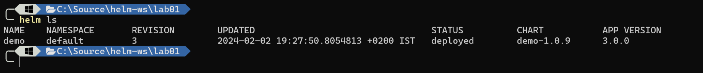

# Lab 02- Release Management

estimated time: 5m

In this tutorial, we will learn how to View Helm status , history and rolling updates

## Step 0: Cleanup Previous Lab

show the current installed chart

```bash
helm ls -a
```



remove the chart

```bash
helm delete demo
```

## Step 1: Use Bitnami helm chart for rabbit MQ

1. Cd to the Lab02 Folder on this Repo

```bash
cd  Lab02
```

2. To create a new Bitnami Rabbit MQ Chart , using defaults , we will use 

```bash
helm upgrade my-rabbit oci://registry-1.docker.io/bitnamicharts/rabbitmq --install
```

> **_NOTE:_**
> Helm chart can be installed from remote repositories without donwloading them

3. Ensure the Helm is installed correctly 

```bash
kubectl get pods
```


## Step 2: Modify the chart by override values file.

1. we shall now add more pods to the statefull set to make it more reliable solution.

2. Create a values.yaml file with the following content :

```yaml
replicaCount: 3
```

```bash
helm upgrade my-rabbit oci://registry-1.docker.io/bitnamicharts/rabbitmq -f values.yaml --install
```

> **_NOTE:_**
> In order to understand what is the right values.yaml file strucutre, you need to inspect the Helm chart from the publisher.
> navigate to https://github.com/bitnami/charts/blob/main/bitnami/rabbitmq/values.yaml to view the bitnami rabbitmq values file

2. Wait for the 3 Pods to spin up and ensure the Helm is installed correctly 

```bash
kubectl get pods
```


3. Check the status of the Helm Chart

```bash
helm status my-rabbit
```

4. Check the history of the Helm Chart

```bash
helm history my-rabbit
```
you should see 2 versions


## Step 3: Working with multiple Values files

1. lets assume that for dev environment you want to have 5 replicas with a limit of 1 CPU and 2G for each pod for the Dev Environment.

<details>
   <summary>Solution</summary>
   Add another values file called dev.values.yaml with the following content 
   
   ```yaml
   replicaCount: 5
   resources:
      limits:
         cpu: 1000m
         memory: 2Gi
   ```
   Then run the following command 

   ```bash
   helm upgrade my-rabbit oci://registry-1.docker.io/bitnamicharts/rabbitmq --values values.yaml --values dev.values.yaml --install
   ```
</details>

2 . Ensure there is a rollout that was deployed by inspecting the helm history : 

```bash
helm history my-rabbit
```


## Step 4: OPEX Issues => REVERT !

oh no , your previous installation caused many VM's to spin up during the weekend ,causing huge OPEX impact.
you are being asked to revert the changes as fast as possible . 

- the ask is to go back to the first version , where you had 1 pod.
- You are not allowed to delete the chart -> some customers are using it !

```bash
helm rollback my-rabbit 1
```

we have switched back to version 1 : our first and most reliable version .
Note this action is also recored as history action.

```bash
helm history my-rabbit
```


## Step 4: Cleanup and the problem with helm

lets try to cleanup the helm chart by running 

```bash
helm delete my-rabbit
```

after few moments it seems all is clear , right ? 

**Wrong**

```bash
kubectl get pvc
```

Helm does not delete PVC's and has some serious challanges with CRD's as well .

This will prevent us from doing more updates to the chart unless special hoolks and patterns will be applied.


