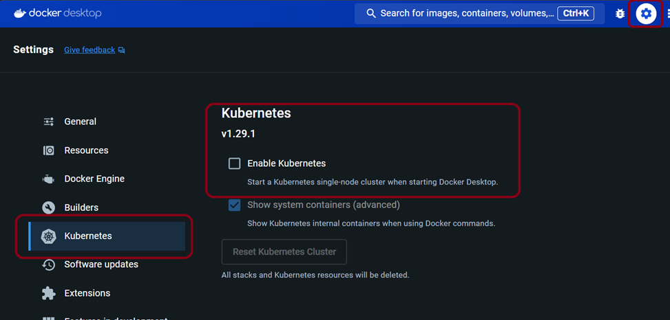
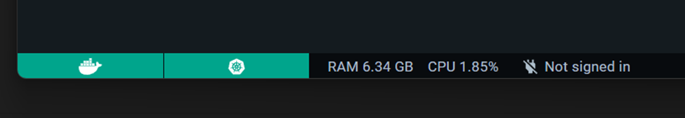

# Helm Workshop

## Introduction

Welcome to the Helm workshop! In this workshop, you will learn how to use Helm, the package manager for Kubernetes, to simplify the deployment and management of applications.

## Prerequisites

Before starting this workshop, make sure you have the following prerequisites:

- Basic knowledge of Kubernetes
- Kubernetes cluster (e.g., Minikube, Docker Desktop, or a cloud-based Kubernetes cluster)
- Helm installed on your local machine

## Workshop Content

1. [Workshop Setup](#Setup)
2. [Lab 01 - Creating a Helm Chart](./Lab01/create-helm.md)
5. [Lab 02 - Managing Releases with Helm](./Lab02/managing-releases.md)

## Setup
1.	Open Docker Desktop and Enable  Setting -> Kubernetes -> Enable Kubernetes


2.	Wait for the Both Docker & kubernetes status to be green in the left bottom corner 


3.	Download helm for windows if you don’t already have it : #Helm(https://helm.sh/docs/intro/install/#from-chocolatey-windows)
4.	Open Power Shell and type : 

```powershell
helm version
kubectl config use-context docker-desktop
kubectl get nodes
```

## Conclusion

Congratulations on completing the Helm workshop! You should now have a good understanding of how to use Helm to package, deploy, and manage applications on Kubernetes.

## Resources

- [Helm Documentation](https://helm.sh/docs/)
- [Helm GitHub Repository](https://github.com/helm/helm)

